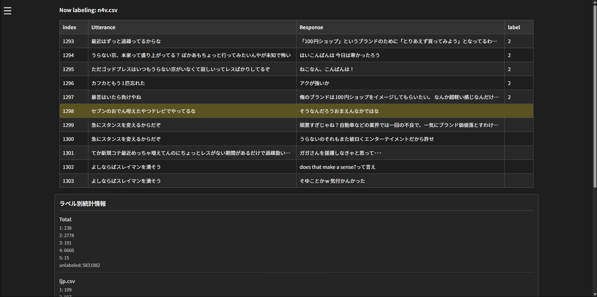

# LabelingWebUI

**機械学習用テキストデータラベリングツール**


LabelingWebUIは,お手持ちのCSVデータに効率的かつ簡単に二値ラベル付けができるWebUIを提供します.

**特徴**
- 複数CSVファイルのキャッシュサポート  
起動時に指定されたすべてのCSVファイルをキャッシュするため,  
即時のファイル切り替えを実現します.
- 統計情報の表示  
各CSVファイル別/ラベル値別の統計情報を表示します.  
目標値までの残量の確認などに便利です.

## 使うには

1. クローンする
```bash
git clone https://github.com/10nm/labeling_webui.git
cd labeling_webui
```

2. 依存関係をインストール
```bash
npm install
```

3. configの設定  

編集・キャッシュするcsvのパスを設定(複数指定可)
```js
module.exports = {
  csvFilePaths: ['file1.csv', 'file2.csv'],
};
```

4. サーバーの起動
```bash
node index.js
```

5. ブラウザからアクセス  
http://localhost:3000
